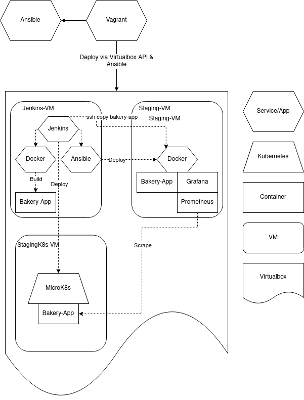
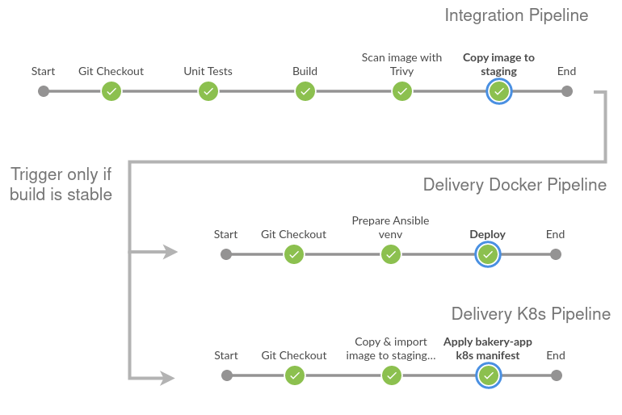

# Welcome to the CI/CD Demo

Hi, in this repo you can find a CI/CD demo with Jenkins, Vaadin-Demo-Bakery-App and additionally a JVM monitoring solution with Prometheus and Grafana.
I've adjusted the Vaadin-Demo-Bakery-App to gather JMX statistics and use the Docker [Buildkit](https://docs.docker.com/build/buildkit/) for improved performance for builds. You can find ,my forked vaadin-demo-bakery-app repository [here](https://github.com/bqsys/vaadin-demo-bakery-app).

## Prerequisites

To run the CI/CD demo you need Virtualbox, Vagrant, Ansible-Core and Python3. 
Tested with Pop!_OS 22.04 (Laptop), Vagrant 2.3.2, Ansible-Core 2.13.3, Python 3.10.6

Figure 1 shows the architecture of the local CI/CD development environment:

## How to reach the services
I'm using an internal network with port-forwardings 

* Grafana http://localhost:3000
* Jenkins http://localhost:8080
* Bakery-App (Docker) http://localhost:9999
* Bakery-App (K8s) http://localhost:9998

# Pipeline description

I have created the following pipelines:
* **Integrate** with the following stages:
    * Git checkout the source code
    * Unit Tests
    * Build the bakery-app within a docker image
    * Copy the image via ssh to the staging virtual machine
    * Save the Junit tests result
* **Deliver-Docker** with the following stages: (run if the Jenkins-Integraton is succssesful or manually)
    * Git checkout the source code
    * Prepare the Python venv for Ansible
    * Deploy the app-bakery-image via Ansible
* **Deliver-K8s** with the following stages:
    * Git checkout the source code
    * Copy the container image to the virtual machine and import it to the local containerd registry
    * Deploy the bakery-app via microk8s kubectl

Figure 2 depicts the pipelines and stages:

# Monitoring description
I decided to use [JMX](https://www.oracle.com/technical-resources/articles/javase/jmx.html) to gather statics about the application.
To store the metrics I use Prometheus which scrapes the metrics via port tcp/8888 from the jmx-agent.
`-javaagent:/opt/jmx/jmx_prometheus_javaagent-0.17.2.jar=8888:/opt/jmx/jmx-exporter.yaml` 

Great people already created a decent JMX dashboard. I've used the following [JMX Dashboard(Basic)](https://grafana.com/grafana/dashboards/14845-jmx-dashboard-basic/).

According to literature the following metrics should be considered:

* Memory Usage (Heap)
    * young generation with just created and short-lived objects & old generation with long living objects
    * check how much memory the app consumes overall
* JVM Threads
    * check concurrency and saturation (CPU & memory)
* Garbage Collector
    * check if CPU spent all it times on garbage collection and does not have time to do other useful work
* CPU Load
    * see above, needed for correlation
* System Memory
    * see above, needed for correlation

Detailed article about [GC](https://www.infoq.com/articles/Java_Garbage_Collection_Distilled/)

Figure 3 shows an excerpt of the JMX Grafana dashboard:

# Tool Justification

Short justifications of the tools. Which can run on your development desktop/laptop. 

## Jenkins
- declerative pipeline, follow Groovy syntax 
- for more complex jobs one can use scripted pipelines (DSL based on Groovy)
- it already provides handy plugins such as junit, maven, git, etc...

## Vagrant
- automated & reproducible VM deployment and configuration
- provides ssh keys
- it has a decent cli
- works on Mac OS, Windows and Linux

## Ansible
- reproducible deployments & configuration
- idempotency
- declerative approach, focus on the what
- reusable roles

## Prometheus
- has many exporters
- it has a jmx agent, very convenient for JVM applications

## Grafana
- chic dashboards, which are flexible adjustable 
- has also an alertmanager

## Docker & Kubernetes
  - Docker: defacto standard to build and run containers (on prem and public clouds). 
  - Kubernetes: to test the container image also on K8s. In this case I've used microk8s from Ubuntu, but it can be any other K8s distribution or even K8s vanilla

# Known issues
* When the stagingk8s virtual machines is suspended, Calico pods are sometimes stuck 
    * Solution: restart the calico pods or rebeoot the virtual machine
* Sometimes the image import to containerd is not working.
    * Solution: re-run the pipeline Deliver-K8s

# Future work

* Turn off the tcp/5000 JMX port. It was needed to test JMX with jconsole
* Use TLS certs for http/api services
* The bakery app already provides [load](https://github.com/bqsys/vaadin-demo-bakery-app#running-scalability-tests) and [integration](https://github.com/bqsys/vaadin-demo-bakery-app#running-integration-tests-and-linter) tests, both should be included
* Analysis of the code quality e.g. with SonarCube
* Scan the container for vulnerabilities e.g. with Snyk
* Use a container registry like Artefactory or Harbor
* Implement web hooks for Jenkins, e.g. if pushed to repository than run the integration pipeline
* Use kubectl from Jenkins to deploy the application
* Further optimize docker build and caching

Figure 4 depicts a future CI/CD(CD) pipeline:

